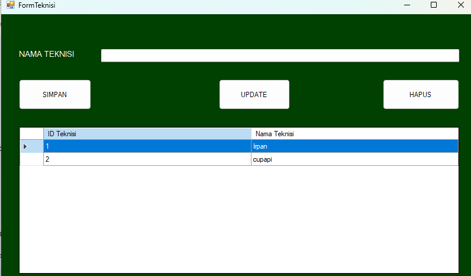
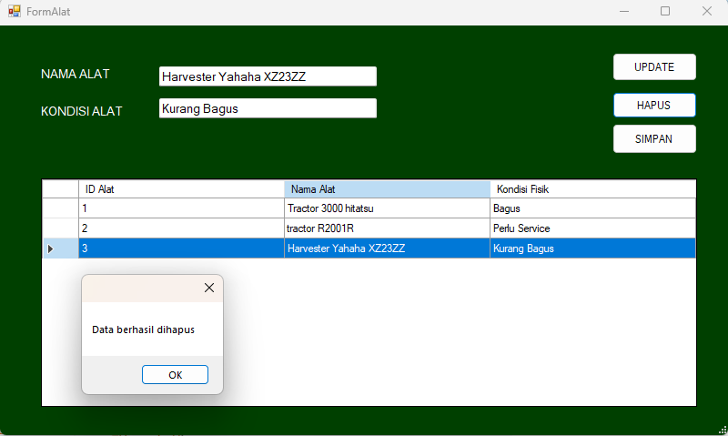
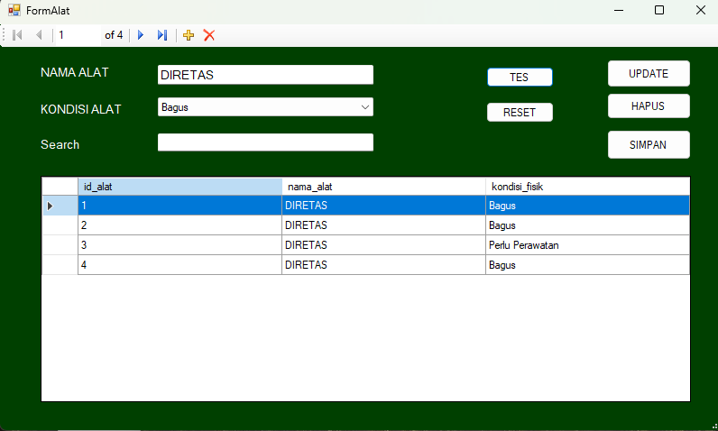

# NamaTim_NyawitSistemMaintenanceAlatPertanian

Sistem Informasi Manajemen Data Maintenance Alat Pertanian berbasis Desktop (Windows Forms) menggunakan C# dan SQL Server. Aplikasi ini digunakan untuk mencatat aset alat, teknisi, dan riwayat perbaikan alat pertanian.

## Teknologi yang Digunakan
* **Bahasa Pemrograman:** C# (.NET Framework)
* **Database:** Microsoft SQL Server
* **Arsitektur:** ADO.NET (SqlDataReader & ExecuteNonQuery)
* **IDE:** Visual Studio

---

## Dokumentasi & Hasil Menjalankan Sistem

### 1. Form Utama (Dashboard & Bukti Koneksi)
*Dashboard utama saat aplikasi dijalankan, membuktikan aplikasi tidak crash dan koneksi Integrated Security berhasil.*

### 2. Form Input Data
*Tampilan form Kelola Maintenance yang siap untuk menerima input data baru.*

### 3. Form Tampilan Data (DataGrid)
*Tampilan DataGridView yang berhasil memuat data dari database SQL Server.*

### 4. Bukti Proses CRUD (Create, Read, Update, Delete)

**A. Bukti Insert (Simpan Data)**

**B. Bukti Update (Perbarui Data)**

**C. Bukti Delete (Hapus Data)**

## 🛡️ UCP2 Skenario Uji Coba SQL Injection (Simulasi)

Sebagai bagian dari pengujian keamanan, skenario simulasi dilakukan untuk memahami celah keamanan dan efektivitas pertahanan aplikasi terhadap serangan eksternal.

### 1. Titik Celah (Vulnerable Point)
Simulasi dilakukan dengan membuat satu fungsi tombol eksekusi yang sengaja dibuat rentan. Celah ini dibuat dengan menggunakan penggabungan string (*string concatenation*) secara langsung dari input pengguna ke dalam *query* SQL tanpa adanya filter atau parameter.

### 2. Payload Injeksi
Untuk mengeksploitasi celah tersebut, input teks berbahaya dimasukkan pada *field* NAMA ALAT:
**Payload:** `' OR 1=1 --`

### 3. Dampak (Impact)
Tanpa adanya pertahanan, perintah SQL akan merespons *payload* tersebut dengan mengubah *query* menjadi kondisi yang selalu bernilai benar (`True` karena `1=1`). Ditambah dengan sintaks `--` yang membuat sisa perintah SQL diabaikan, hal ini menyebabkan perintah `UPDATE` (atau `DELETE`) teraplikasi pada **seluruh baris** di dalam tabel, bukan hanya pada satu data. (Contoh: seluruh data nama alat berubah menjadi 'Diretas').

**Bukti Injeksi

### 4. Mitigasi dan Pertahanan (Defense Strategy)
Sistem ini telah berhasil menangkal serangan SQL Injection pada fungsi-fungsi utamanya (CRUD) dengan menerapkan **Defense in Depth**:
* **Stored Procedures & Parameterized Queries:** Memisahkan antara kode SQL dan data input dari pengguna. Input berbahaya hanya akan dianggap sebagai teks string biasa dan tidak akan dieksekusi sebagai perintah SQL.
* **Views:** Mencegah akses langsung ke struktur tabel fisik database dengan menggunakan tabel virtual (seperti `vwAlatPublic`).
